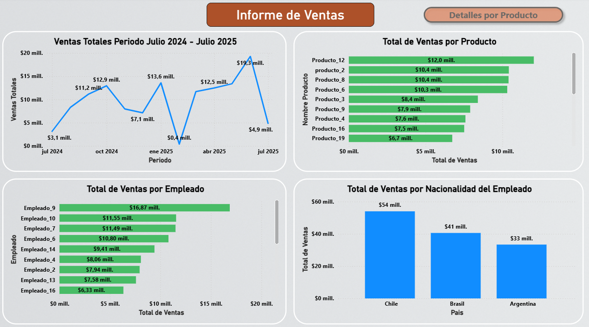
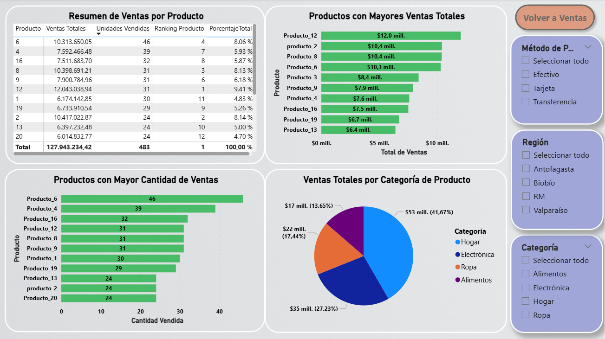
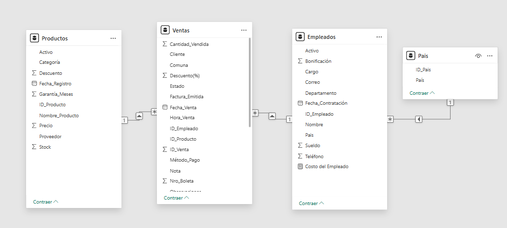

## 📊 Dashboard de Ventas – Power BI

El objetivo del siguiente ejercicio es simular un informe de ventas interactivo para un comercio, explorando distintos enfoques de análisis con Power BI:

- Evolución temporal de las ventas en un periodo anual.

- Ventas por producto y ranking de productos con mayores ingresos.

- Ventas por empleado, identificando desempeños destacados.

- Ventas por nacionalidad del empleado, para análisis comparativo.

- Detalle por producto: resumen de ventas, unidades vendidas, participación porcentual y ranking.

- Ventas por categoría de producto.

- Aplicación de filtros dinámicos (método de pago, región y categoría).

📌 **Nota:** Los datos utilizados en el informe son simulados y tienen un fin únicamente educativo.

***

### 🛠️ Herramientas y técnicas utilizadas

- **Power Query:** Transformación y limpieza de datos. 

- **Power BI Desktop:** Creación del dashboard y paneles interactivos.

- **Visualizaciones:** gráficos de barras, líneas, torta y tablas.

- Aplicación de **filtros dinámicos y botones de navegación**.

***

### 📷 Vistas del Dashboard

**Vista 1:** Evolución temporal, ventas por producto, ventas por empleado y ventas por nacionalidad de empleado.  

**Vista 2:** Detalles de productos vendidos, ranking de productos, ventas por categoría de producto.

***

### Modelado de Datos

El modelo fue construido a partir de **cuatro tablas distintas** (Ventas, Empleados, Productos y Pais). Se establecieron relaciones entre ellas para permitir un análisis cruzado de las métricas principales.  

***

### 📥 Descarga de archivo .pbix 

[Dashboard Interactivo de Ventas](https://github.com/JuanAlbornoz32/Proyectos_Bootcamp_Analisis_de_Datos/raw/main/ejercicios_power_bi/analisis_de_ventas/informe_de_ventas.pbix)